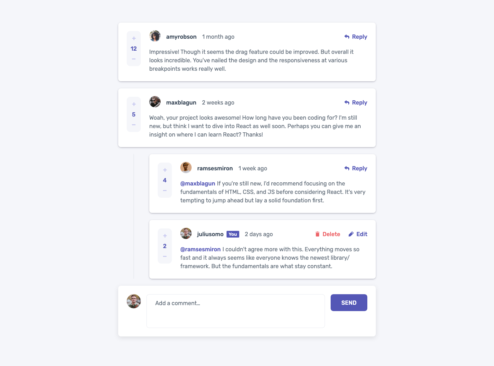

# Interactive comments section solution

This is a solution to the [Interactive comments section challenge on Frontend Mentor](https://www.frontendmentor.io/challenges/interactive-comments-section-iG1RugEG9). Frontend Mentor challenges help you improve your coding skills by building realistic projects.

## About the Project

This project simulates a social media-like comments section where users can engage by posting comments, replying to existing ones, deleting comments with a confirmation popup, and upvoting or downvoting comments for a dynamic user interaction experience.

**Fact:** Since this project was built when I was learning React, it's basically not a "how react should be used" project, but still it seems to work.

## Preview and Links

<b>Open Preview</b>

 

 

| View it live: | [Live Demo URL](https://ionstici.github.io/interactive-comments-section) | [Frontend Mentor](https://www.frontendmentor.io/solutions/interactive-comments-section-qYlTnoMTY-) |
| ------------- | ------------------------------------------------------------------------ | -------------------------------------------------------------------------------------------------- |

## Features

-   **Post Comments:** Users can add new comments to the section.
-   **Edit Comments:** Users can edit their own comments, allowing for corrections or updates to their posts.
-   **Reply to Comments:** Ability to reply to any comment, creating threaded discussions.
-   **Delete Comments:** Comments can be deleted, with an animated popup for confirmation.
-   **Upvote/Downvote:** Users can upvote or downvote comments.
-   **Responsive Design:** Built to function seamlessly across various devices.

_Note:_ All interactions within this comments section, including posting, replying, editing, deleting, upvoting, and downvoting, are managed in memory. This means that any changes made will be lost upon window reload or page refresh.

## Tech Stack

-   **`Vite`:** For a fast and modern development setup.
-   **`React`:** To handle the rendering of the comments section.
-   **`Sass`:** For styling, providing a clean and modular approach to CSS.

## Deployment

This project is deployed using **GitHub Pages**.
